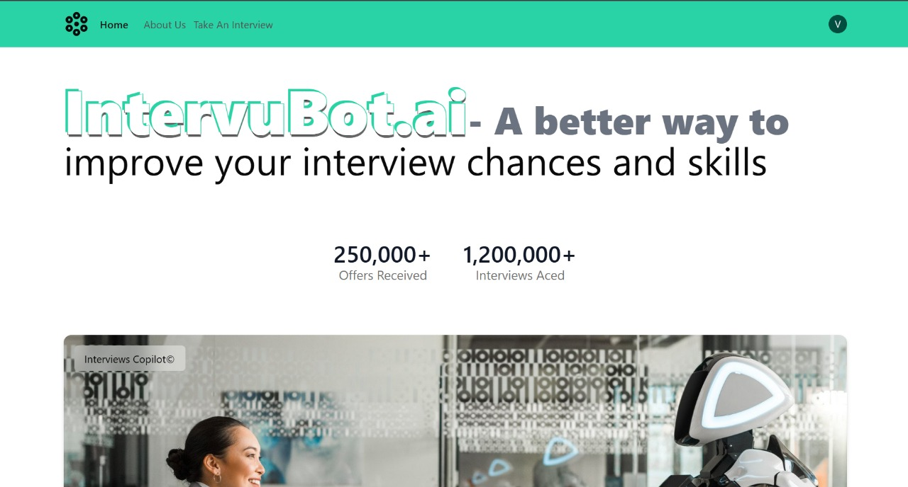
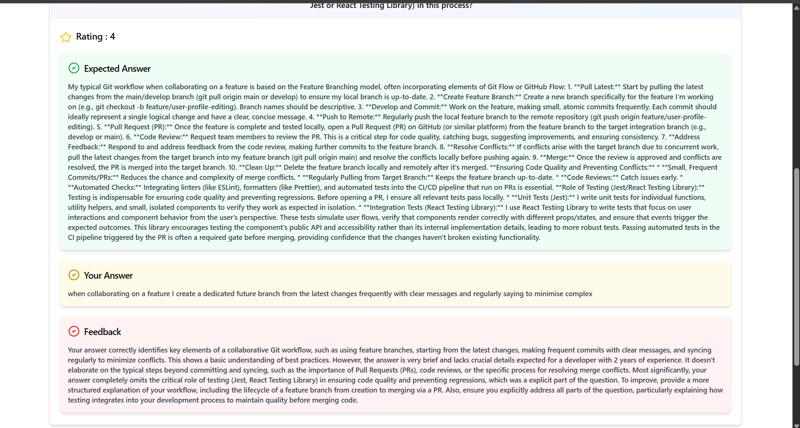
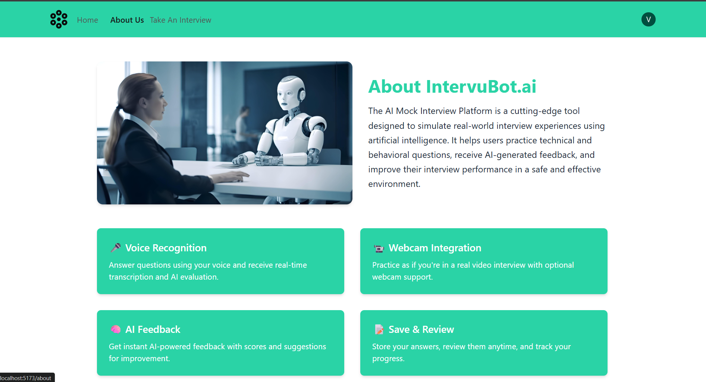
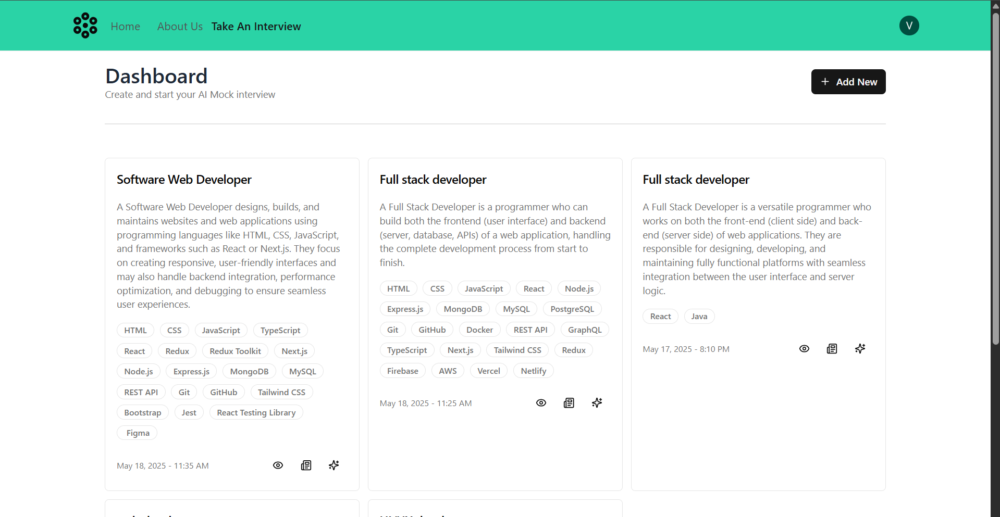
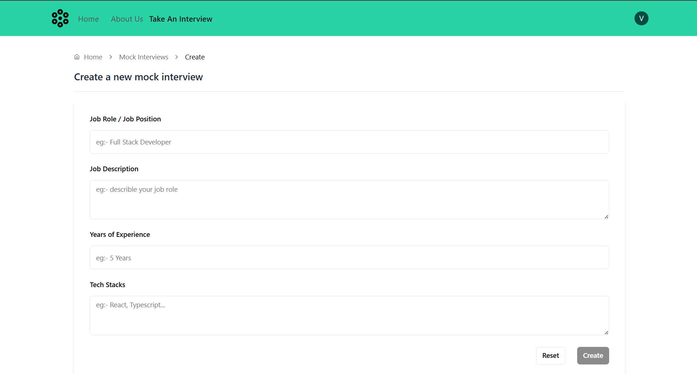
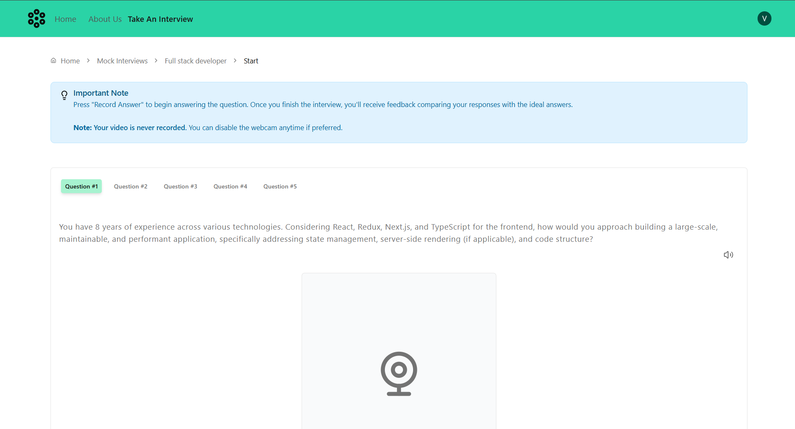
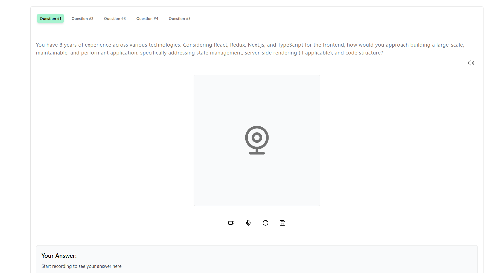
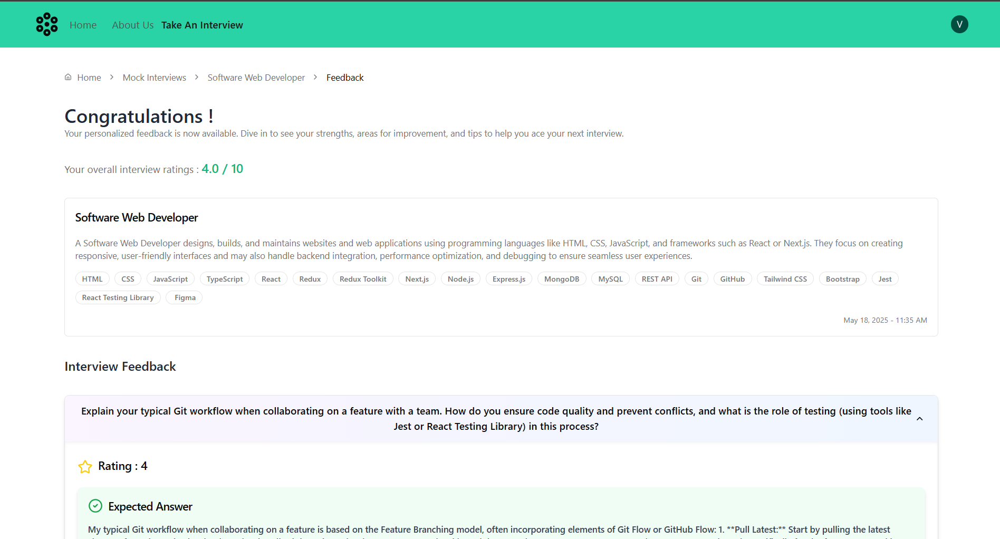

# 🤖 IntervuBot.ai — AI Mock Interview Platform

**IntervuBot.ai** is a cutting-edge AI-powered mock interview platform designed to simulate real-world interview experiences. It helps users practice technical and behavioral questions, receive AI-generated feedback, and improve their interview skills in a safe, interactive environment.

---

## 🎯 Core Features

- 🔐 **User Authentication** with Clerk & Firebase (for data storage & realtime updates)
- 🧠 **Google Gemini AI Integration** for question generation and answer evaluation
- 🎤 **Voice Recognition**: Answer questions using your voice with real-time transcription & AI feedback
- 📹 **Webcam Integration**: Practice in a realistic video interview setting using React Webcam
- 📝 **Save & Review**: Store your answers and review your interview history anytime
- 📊 **Real-time AI Feedback** with scoring and personalized improvement suggestions
- 🎨 **Responsive UI** built with React + Tailwind CSS
- ⚡ **Fast Development** using Vite + TypeScript

---

## 🧱 Tech Stack

| Category         | Technology              |
|------------------|-------------------------|
| Frontend         | React.js, Vite, TypeScript |
| Styling          | Tailwind CSS            |
| Authentication   | Clerk                   |
| AI Integration   | Google Gemini API       |
| Data Storage     | Firebase Firestore      |
| Webcam           | React Webcam            |
| Voice Recognition| Web Speech API          |

---

## 🧠 How It Works

1. Users **sign up or log in** with Clerk.
2. Users select a job role or interview type (technical or behavioral).
3. Google Gemini AI generates **contextual interview questions**.
4. Users can **answer by typing or voice**; webcam video recording is optional.
5. AI evaluates answers in real-time and provides **feedback, scores, and tips**.
6. Answers and session data are saved in **Firebase Firestore** for later review.
7. Users track their progress over time through saved interviews.

---

## 💡 Future Improvements & Ideas

- 📄 **ATS Resume Checker**  
  Analyze resumes for job description alignment and give personalized suggestions.

- ⭐ **Behavioral Question Mode**  
  Focused training on HR/behavioral rounds with STAR (Situation, Task, Action, Result) format guidance.

- 👥 **Peer Review System**  
  Allow users to review each other’s answers and provide constructive feedback.

- 📈 **Performance Analytics Dashboard**  
  Visualize user progress, strengths, weaknesses, and improvement trends over time.

- 🏅 **Gamification**  
  Award badges, points, and levels based on user milestones and performance.

---

## 📸 Demo

> Real-time AI interview simulation with voice and webcam integration.
